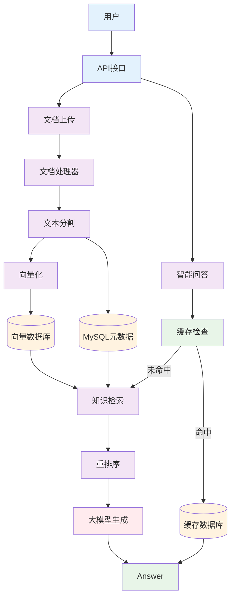
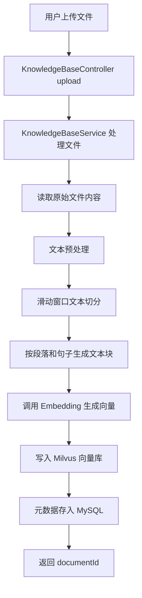
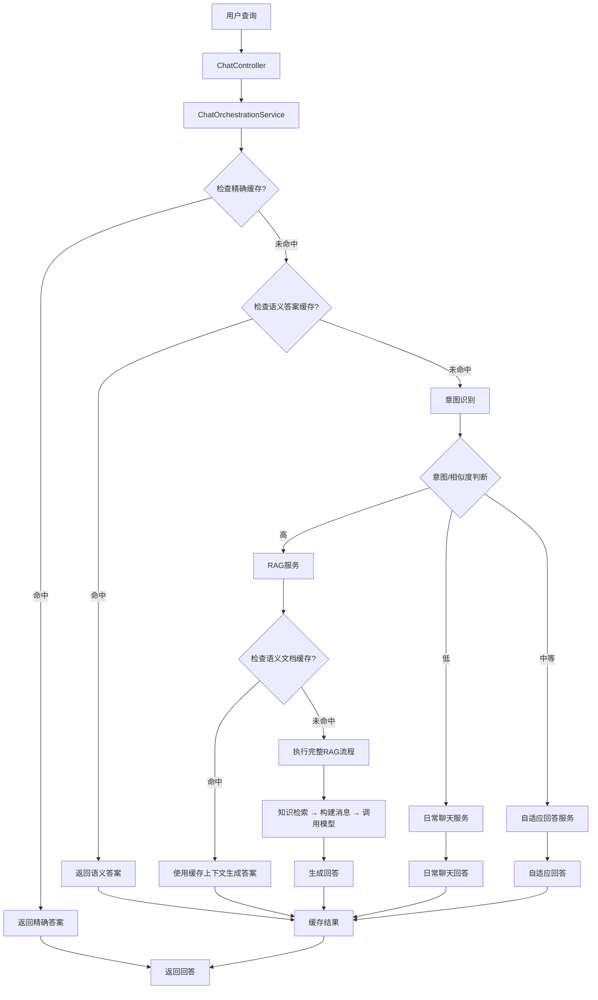

# 企业级智能知识问答系统

> 基于RAG架构的智能知识管理平台，为企业提供高效、准确的文档问答服务

## 📋 项目简介

这是一个基于RAG（Retrieval-Augmented Generation）架构的企业级智能知识问答系统。系统支持多格式文档上传、智能语义检索和流式对话问答，通过多级缓存和智能路由机制，显著提升知识检索效率和问答准确性。

## 🏗️ 系统架构

### 整体架构图



## 🚀 核心功能

### 📁 文件上传处理流程



### 💬 智能问答流程



## 🛠️ 技术栈

### 后端框架
- **Spring Boot 3.x** - 应用框架
- **Reactor** - 响应式编程
- **Spring AI** - AI应用集成

### 数据存储
- **Milvus** - 向量数据库
- **MySQL** - 关系型数据库
- **Redis** - 缓存 & 向量检索

### AI服务
- **通义千问** - 大语言模型
- **阿里云Embedding** - 文本向量化
- **OpenSearch** - 重排序服务

### 文档处理
- **多格式支持** - PDF、MD等
- **滑动窗口分块** - 智能文本分割
- **语义分块** - 保持上下文连贯性

## 📚 API文档

### 文件上传接口

**接口：**

```http
POST /api/knowledge/upload
Content-Type: multipart/form-data
```

**参数:**
```
- file: 文件 (必填)
- fileName: 文件名 (必填)
- description: 文件描述 (可选)
```

**请求示例：**
```bash
curl -X POST \\
http://localhost:8080/api/knowledge/upload \\
-F "file=@document.pdf" \\
-F "fileName=技术文档" \\
-F "description=产品技术规格说明"
```

**响应示例：**
```json
{
  "success": true,
  "message": "文件上传处理成功",
  "data": "DOC_1701234567890_abc123def"
}
```

### 智能问答接口

**接口：**
```http
GET /api/chat/rag/stream
Accept: text/event-stream
```

**参数：**
```
- question: 问题内容 (必填)
```

**请求示例：**
```bash
curl -X GET \\
"http://localhost:8080/api/chat/rag/stream?question=什么是RAG架构?" \\
-H "Accept: text/event-stream"
```

**流式响应示例：**
```
data: {"content": "RAG", "finished": false}

data: {"content": "架构是", "finished": false}

data: {"content": "检索增强生成...", "finished": true, "usage": {"inputTokens": 150, "outputTokens": 89, "totalTokens": 239}}
```

### 知识检索接口

**接口：**
```http
GET /api/knowledge/search
```
**参数：**
```
- query: 查询内容 (必填)
- topK: 返回数量 (可选，默认10)
- topRatio: 截断比例 (可选)
```

4. **在线访问服务**
```
http://115.190.202.146:3000/
# 运行需要成本，非7*24小时运行，如有需要可以通过邮箱联系我
```

## 🤝 贡献指南

我们欢迎任何形式的贡献！请阅读 [CONTRIBUTING.md](CONTRIBUTING.md) 了解如何参与项目开发。

## 📄 许可证

本项目采用 MIT 许可证 - 查看 [LICENSE](LICENSE) 文件了解详情。

## 📞 联系我们

- 项目主页：https://github.com/Yuri-hack/rag-knowledge-qa
- 问题反馈：https://github.com/Yuri-hack/rag-knowledge-qa/issues
- 邮箱：15690863316@163.com

---

**如果这个项目对您有帮助，请给个⭐️支持一下！**